# Hướng dẫn Vận hành — Phân hệ Cho thuê (LMS)

!!! info
    Tài liệu này hướng dẫn nhân viên kinh doanh và quản lý cho thuê thao tác hàng ngày trên hệ thống Odoo. Hướng dẫn kế toán xem [Hướng dẫn Kế toán AMS](../ke-toan/van-hanh.md).

---

## Phần 1 — Quản lý Khách hàng

### 1.1 Tạo khách hàng mới

Mở: **Liên hệ → Khách hàng → Mới**

**Nếu khách hàng là Công ty:**
1. Chọn loại **Công ty** (ở trên cùng)
2. Nhập tên công ty
3. Nhập **Mã số thuế** (hệ thống kiểm tra trùng — nếu đã tồn tại sẽ báo lỗi)
4. Nhập Ngày cấp, Nơi cấp, Lần thay đổi, Ngày thay đổi
5. Upload **Giấy đăng ký kinh doanh** (có thể upload nhiều file)
6. Bấm **Lưu** — hệ thống tự tạo mã `DN-XXXXX`

**Nếu khách hàng là Cá nhân:**
1. Chọn loại **Cá nhân**
2. Nhập họ tên
3. Nhập **Số CCCD/Passport** (hệ thống kiểm tra trùng)
4. Nhập Mã số thuế (nếu có), Ngày cấp, Nơi cấp
5. Bấm **Lưu** — hệ thống tự tạo mã `CN-XXXXX`

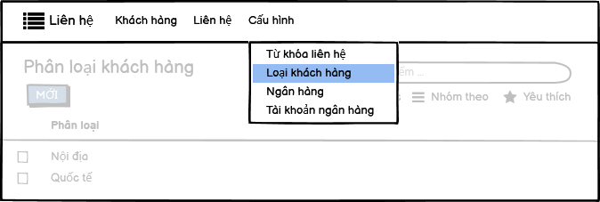

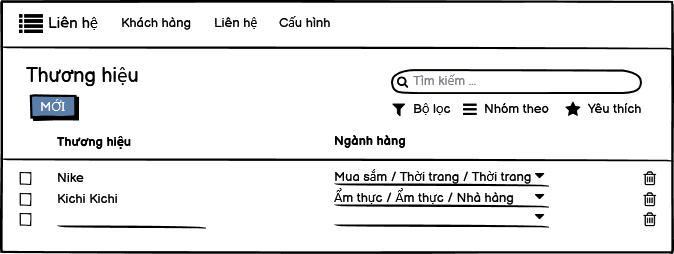

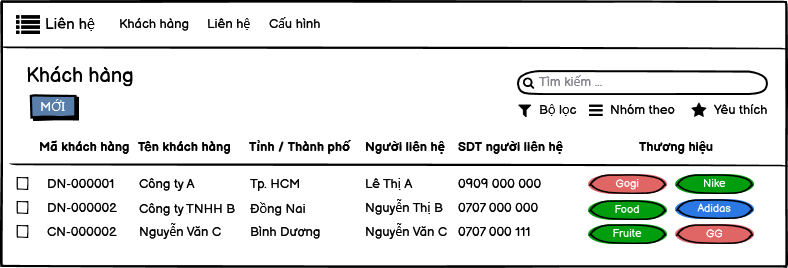

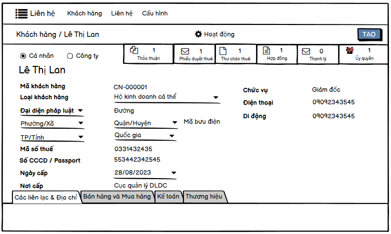

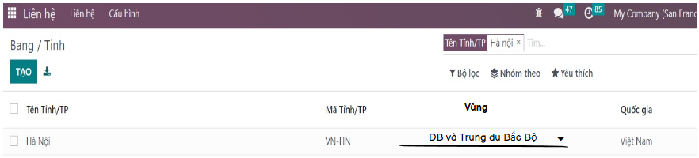

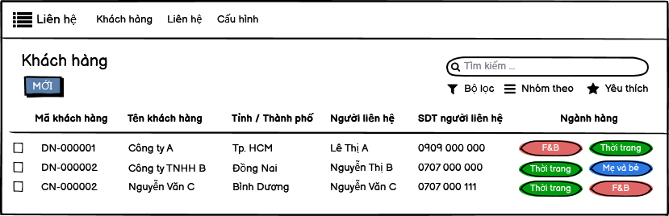

### 1.2 Thêm Thương hiệu cho khách hàng

1. Mở chi tiết khách hàng → Tab **Thương hiệu**
2. Bấm **Thêm một dòng** → chọn thương hiệu từ danh sách
3. Ngành hàng sẽ tự động điền theo thương hiệu

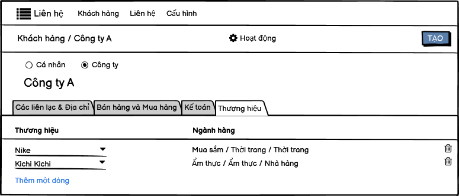

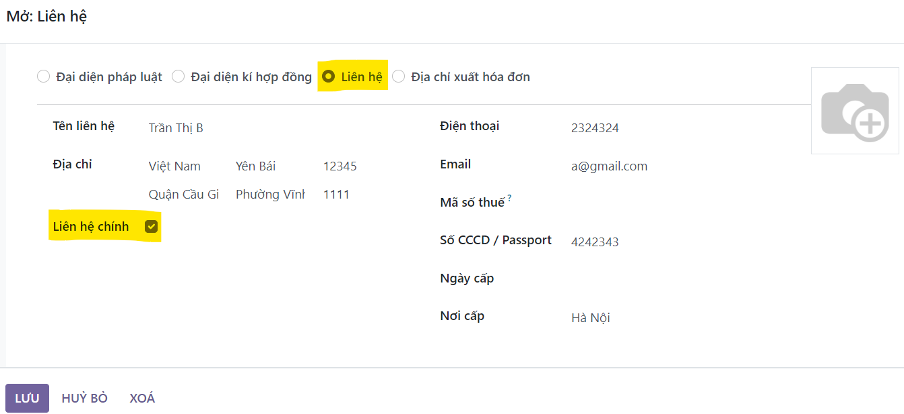

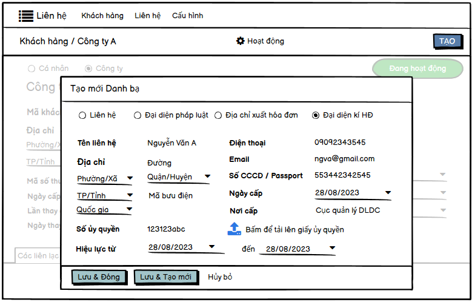

### 1.3 Thêm Đại diện pháp luật

1. Mở chi tiết khách hàng → Tab **Các liên lạc & Địa chỉ**
2. Bấm **Thêm** → chọn **Đại diện pháp luật**
3. Nhập Số CCCD, Ngày cấp, Nơi cấp, **Chức vụ**
4. Upload hình đại diện (nếu có)
5. Bấm **Lưu và Đóng**

!!! tip "Mẹo"
    Tương tự cho **Đại diện ký hợp đồng** — cần nhập thêm Số ủy quyền, upload Giấy ủy quyền, Ngày hiệu lực (bắt buộc).

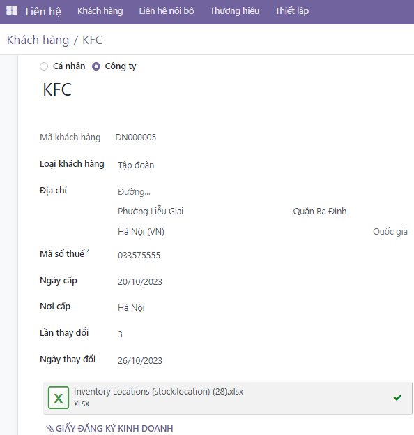

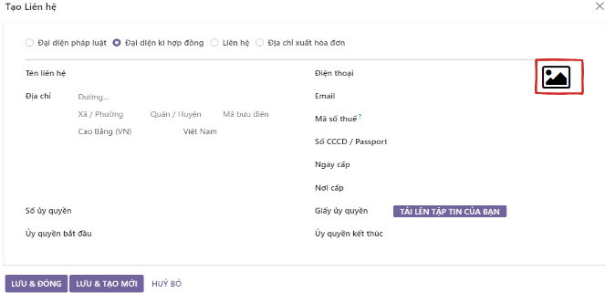

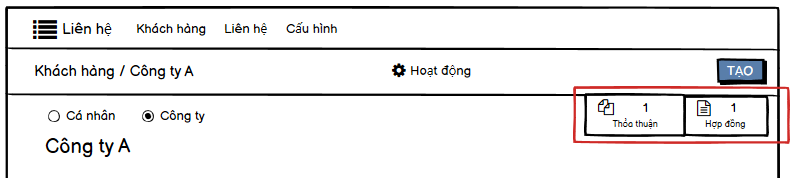

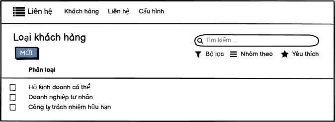

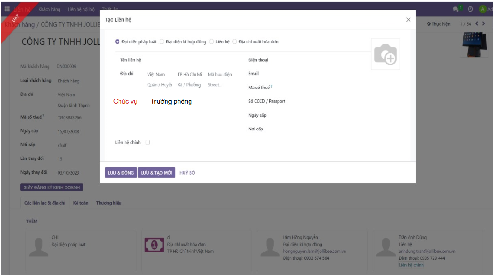

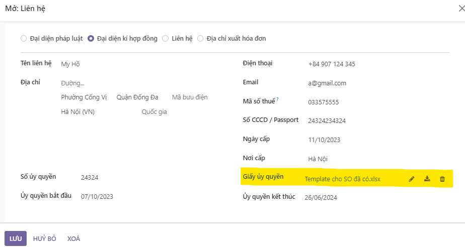

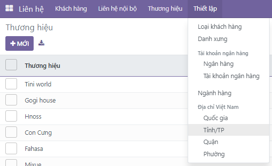

### 1.4 Chọn Người liên hệ chính

Trong danh sách liên hệ của khách hàng → tick checkbox **Người liên hệ chính** cho 1 người.

!!! tip "Mẹo"
    Chỉ được chọn **1 người** làm liên hệ chính tại 1 thời điểm. Nếu tick 2 người → hệ thống báo lỗi khi lưu.

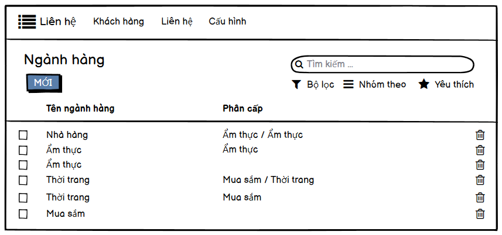

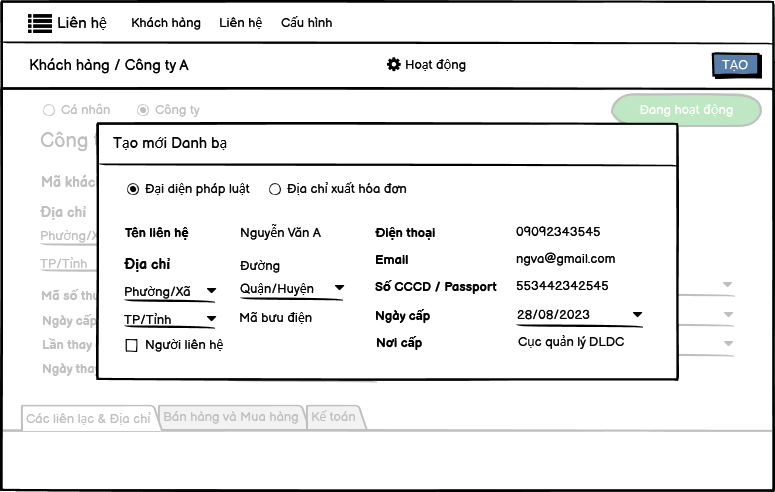

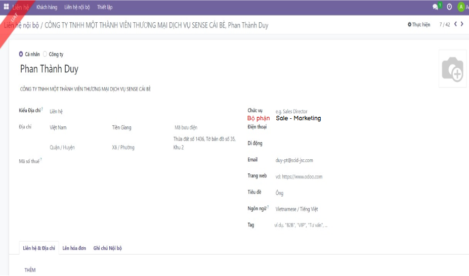

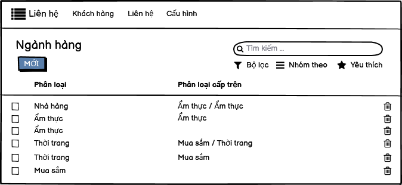

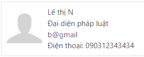

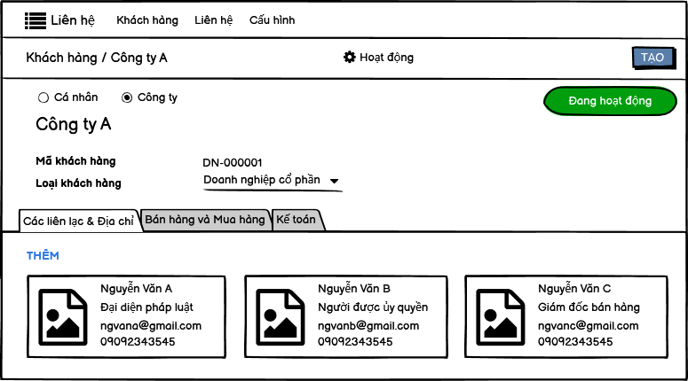

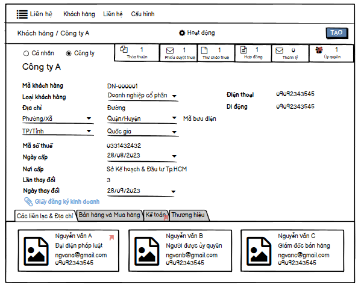

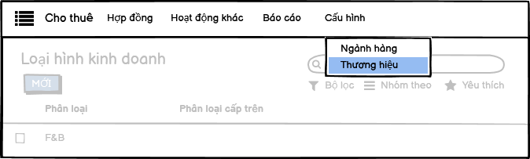

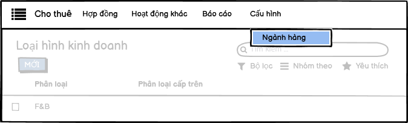

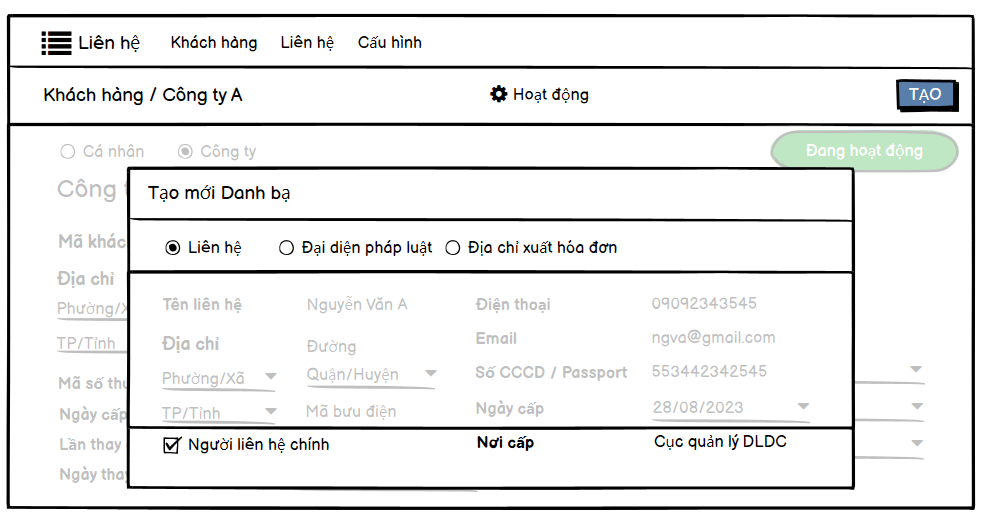

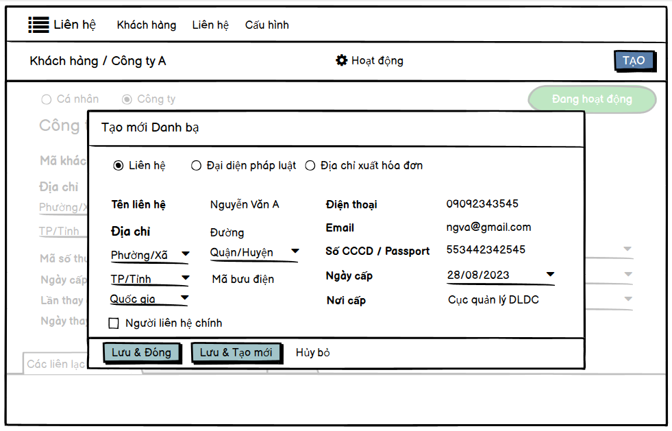

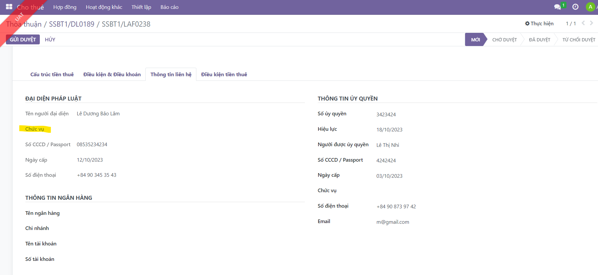

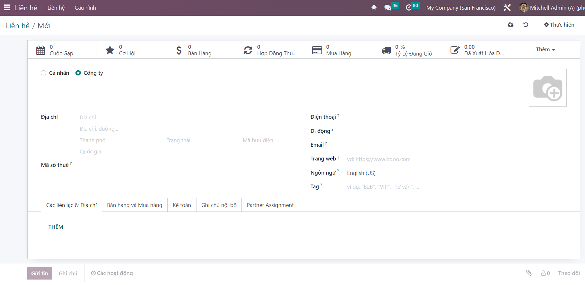

---

## Phần 2 — Quy trình Cho thuê NLA

### Bước 1: Tạo Thỏa thuận (Deal)

Mở: **Cho thuê → Hợp đồng → Thỏa thuận → Mới**

1. Chọn **Mall** → Mã Mall tự điền
2. Chọn **Tầng** (theo Mall) → chọn **Vị trí** (theo Tầng) → Loại vị trí, Diện tích tự điền
3. Chọn **Khách hàng** → chọn **Thương hiệu** → Ngành hàng tự điền
4. Nhập **Thời hạn thuê**, **Ngày bắt đầu** → Ngày kết thúc tự tính
5. Bấm **Lưu** → hệ thống tạo mã `{Mall}/DL{XXXX}`

### Bước 2: Tạo Phiếu duyệt thuê (LAF)

Từ Deal → bấm **Tạo phiếu duyệt thuê** → hệ thống tự tạo LAF với thông tin từ Deal.

1. Kiểm tra thông tin khung chính (Mall, Vị trí, KH — readonly, lấy từ Deal)
2. Nhập **Loại hình kinh doanh** (bắt buộc)
3. Điền **Tab Điều kiện tiền thuê:**
   - Chọn Mô hình tính phí (5 case — xem hướng dẫn bên dưới)
   - Nhập đơn giá tiền thuê, phí dịch vụ, QC&KM, vệ sinh theo từng năm
   - Hệ thống tự tính tổng tiền thuê/tháng
4. Điền **Tab Điều kiện & Điều khoản:**
   - Thời hạn HĐ, Chu kỳ hóa đơn (Tháng/Quý/Năm)
   - Tiền cọc (chọn Loại cọc + nhập số tiền + ngày TT)
   - Free rent, Điều kiện thi công
5. Bấm **Gửi duyệt** → popup chọn người duyệt → **Xác nhận**

!!! info
    Trạng thái Deal chuyển thành "Chờ duyệt thuê".

**Nếu bị từ chối:** Bấm nút tạo LAF mới (copy thông tin) → chỉnh sửa → gửi duyệt lại.

### Bước 3: Thư chào thuê (OL) — Chỉ NLA

Khi LAF được duyệt → hệ thống **tự động tạo OL**.

1. Soạn OL bản cứng → gửi khách hàng ký
2. Khách đồng ý → **Upload OL đã ký** → trạng thái "Đã ký"
3. Khách không đồng ý → **Hủy OL** → quay lại sửa LAF

### Bước 4: Tạo Hợp đồng (LA)

Khi OL đã ký + kế toán xác nhận đã nhận cọc lần 1 → hệ thống **tự động tạo HĐ nháp**.

1. Kiểm tra thông tin HĐ (lấy từ LAF/OL)
2. Chỉnh sửa Tab Điều kiện tiền thuê và Tab Điều kiện & Điều khoản (nếu cần)
3. Bấm **Gửi duyệt** → chọn người duyệt

   > Nếu chưa nhận đủ cọc bắt buộc → popup cảnh báo "Chưa nhận đủ cọc, bạn có muốn tiếp tục không?"

4. Được duyệt → Soạn LA bản cứng → gửi khách ký
5. Khách ký → **Upload LA đã ký** → bấm **Xác nhận**

   > Nếu khách muốn sửa → Tạo yêu cầu cập nhật LA → gửi duyệt thay đổi (Commercial)

### Bước 5: Bàn giao mặt bằng

1. Kế toán xác nhận đã nhận đủ cọc
2. Bấm **Xác nhận cho thuê**
3. **Upload biên bản BGMB** (Bàn giao mặt bằng)
4. Đến ngày tính tiền thuê → trạng thái Deal chuyển thành **"Đang thuê"**

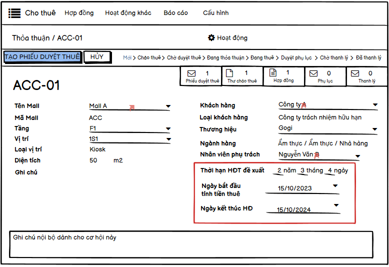

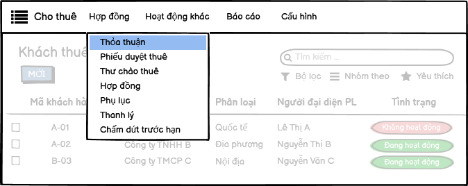

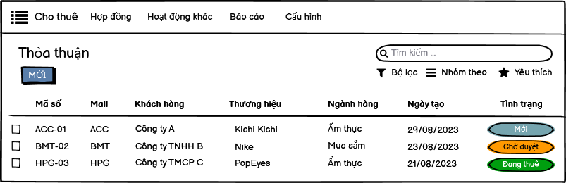

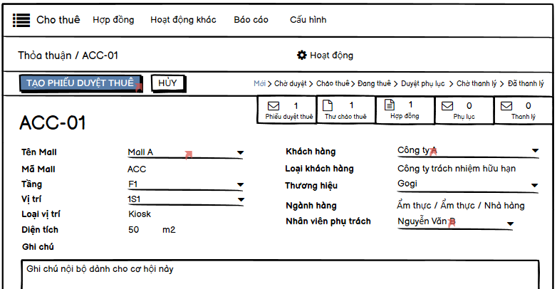

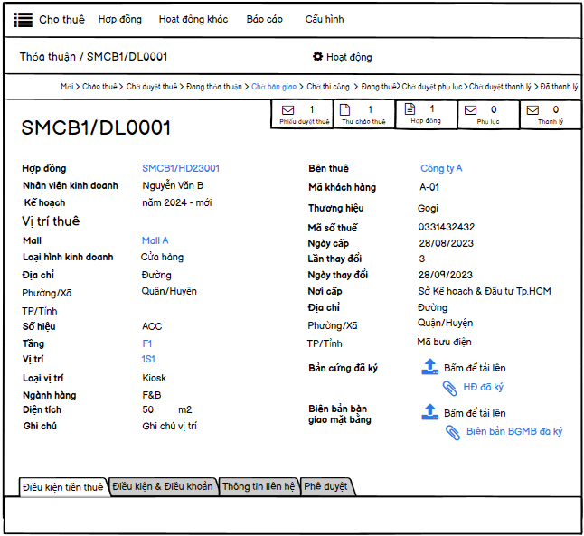

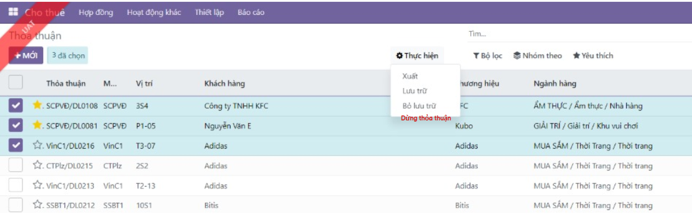

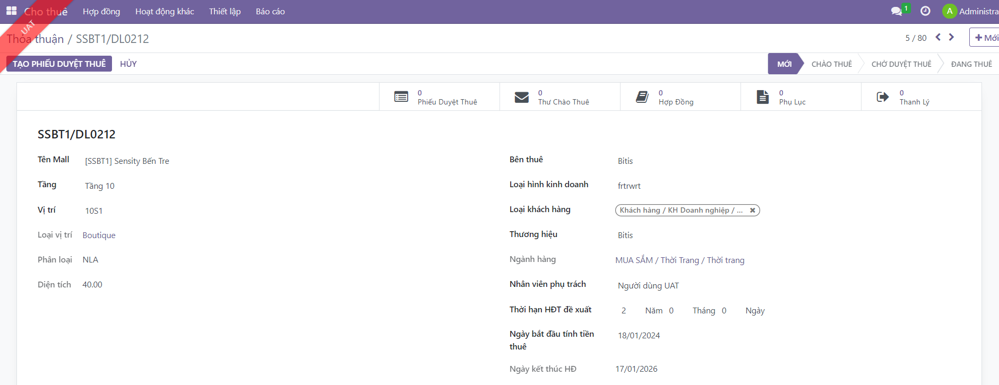

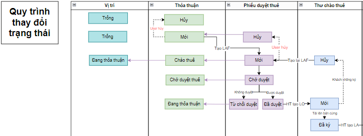

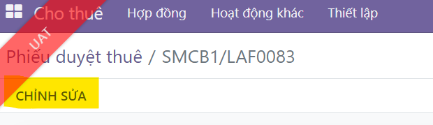

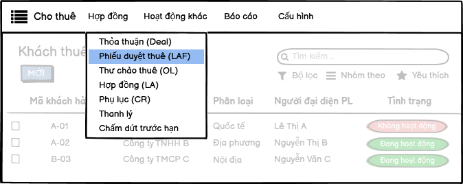

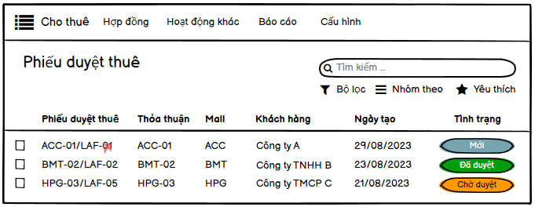

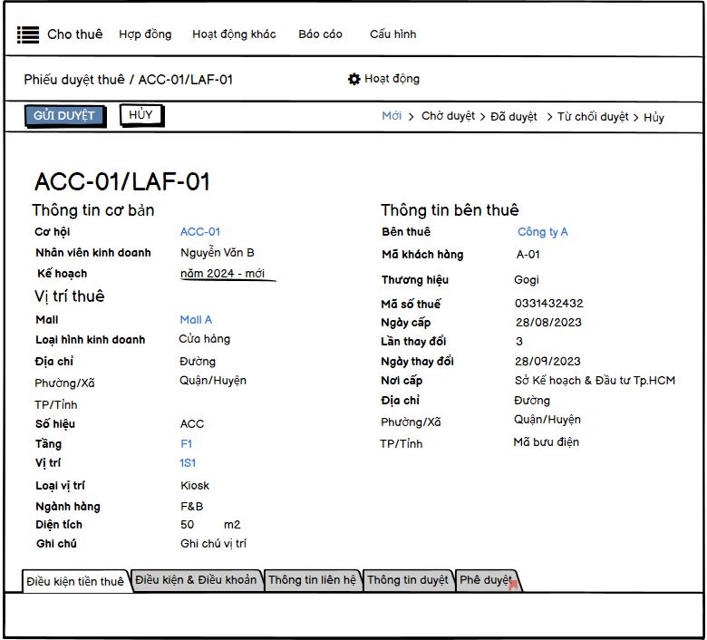

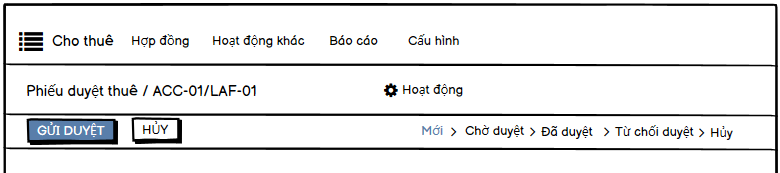

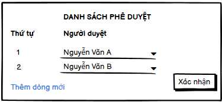

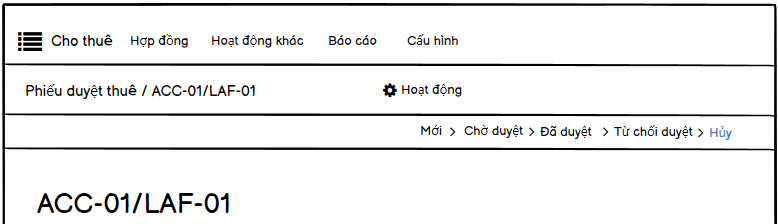

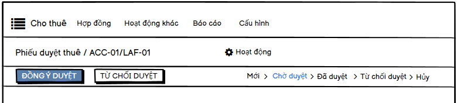

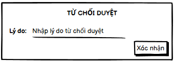

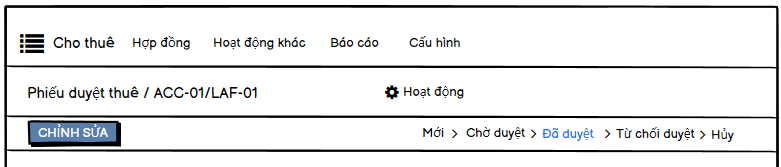

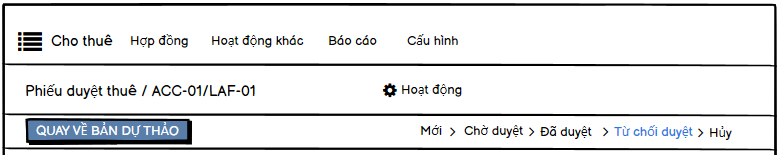

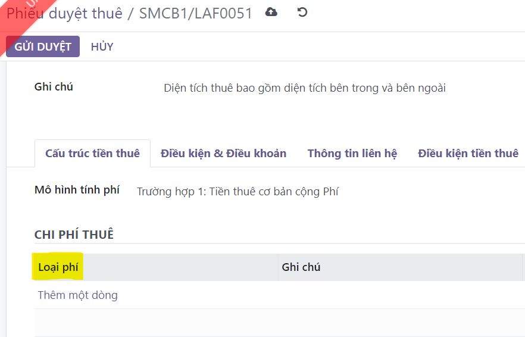

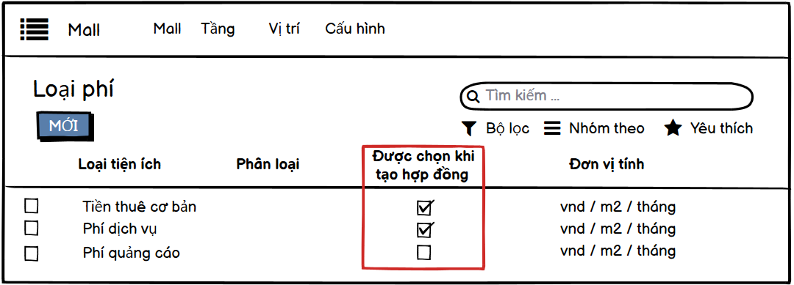


---

## Phần 3 — Quy trình Cho thuê Non-NLA (Rút gọn)

Giống NLA nhưng **bỏ qua bước OL** (Thư chào thuê):

1. Tạo Deal → Tạo LAF **rút gọn** (không có Tab Điều kiện tiền thuê, không có Phụ lục tờ trình)
2. LAF được duyệt → hệ thống **tự động tạo LA** (không qua OL)
3. Duyệt LA → Ký → Upload → Xác nhận → Bàn giao

**Khác biệt LAF Non-NLA:**
- Bỏ Tab Điều kiện tiền thuê
- Bỏ: quyền chọn gia hạn, checkbox đồng thời thuê dự án khác, % NLA
- Thêm: Thời gian tháo dỡ, Đơn vị thi công, ĐT liên hệ thi công, Hạn mức bảo hiểm, Ngày tiếp nhận hồ sơ BH

---

## Phần 4 — Phụ lục Hợp đồng

Khi cần thay đổi giá thuê, gia hạn, hoặc bổ sung điều khoản:

1. Mở HĐ đang thuê → bấm **Tạo phụ lục**
2. Chỉnh sửa thông tin cần thay đổi
3. Bấm **Gửi duyệt** → chọn người duyệt
4. Được duyệt → Soạn phụ lục bản cứng → gửi khách ký
5. Upload bản cứng đã ký → bấm **Xác nhận phụ lục**

!!! info
    Trạng thái Deal: Đang thuê → Chờ duyệt phụ lục → Đang thuê (sau khi xác nhận)


---

## Phần 5 — Thanh lý Hợp đồng

### 5.1 Thanh lý hết hạn

1. Mở HĐ sắp hết hạn → bấm **Tạo đề nghị thanh lý**
2. Soạn biên bản thanh lý (BBTL) → gửi khách ký → upload
3. Bấm **Xác nhận thanh lý**
4. Bấm **Tạo đề nghị thanh toán** (cọc thi công) → Kế toán xác nhận nhận cọc
5. Nhà thầu thi công → Nghiệm thu → upload biên bản nghiệm thu
6. Kế toán hoàn cọc (nếu có) → xuất hóa đơn → **Hoàn tất**

### 5.2 Chấm dứt trước hạn

1. Bấm **Tạo đề nghị chấm dứt HĐ** → Gửi duyệt
2. Được duyệt → Soạn BBTL → KH ký → Upload → Xác nhận
3. Tiếp tục quy trình cọc thi công + nghiệm thu như thanh lý hết hạn


---

## Phần 6 — Dừng Thỏa thuận

Khi muốn hủy 1 Deal chưa có hợp đồng:

**Từ danh sách:** Tick chọn nhiều Deal → **Thực hiện → Dừng thỏa thuận**

**Từ chi tiết Deal:** Bấm **Thực hiện → Dừng thỏa thuận**

1. Hệ thống kiểm tra: nếu Deal đã có HĐ (trạng thái khác Hủy) → báo lỗi, không cho dừng
2. Popup cảnh báo: "Sau khi dừng không thể khôi phục. Tiếp tục?"
3. Nhập **Lý do** (bắt buộc) → bấm **Tiếp tục**
4. Hệ thống archive Deal + tất cả LAF, OL liên quan
5. Ribbon "Dừng thỏa thuận" hiển thị trên form
6. Vị trí trở về **available** — có thể tạo Deal mới

---

## Phần 7 — Quản lý Đặt cọc

### 7.1 Tạo đề nghị thanh toán cọc

Từ HĐ hoặc Phiếu thanh lý → bấm **Tạo đề nghị thanh toán**:

1. Popup hiện ra → chọn **Loại phí** (chỉ hiện loại chưa tạo thanh toán)
2. Chọn **Loại hình thanh toán** (Tiền mặt / Ngân hàng)
3. Chọn **Tài khoản nhận** + **Phương thức** (Thủ công / Gộp)
4. Nhập **Ngày thanh toán**
5. Bấm **Tạo thanh toán** → hệ thống tạo phiếu thu trên AMS

### 7.2 Cập nhật trạng thái cọc

- Khi phiếu thu được **mark reconciled** (khớp lệnh NH) → cọc tự chuyển từ "Chờ nhận" → **"Đã nhận"**
- Trạng thái cập nhật trên tất cả LAF, OL, LA liên quan

### 7.3 Lưu ý

- Không được xóa khoản cọc đã ở trạng thái "Chờ nhận" hoặc "Đã nhận"
- Có thể sửa số tiền cọc:
  - Nếu số tiền mới ≤ số đã nhận → trạng thái = "Đã nhận"
  - Nếu số tiền mới > số đã nhận → trạng thái = "Chờ nhận"


---

## Phần 8 — 5 Mô hình tính phí thuê

Khi điền Tab Điều kiện tiền thuê trong LAF, chọn 1 trong 5 mô hình:

| Case | Tên | Cách tính |
|------|-----|-----------|
| 1 | Tiền thuê cơ bản + Phí cố định | Đơn giá × m²/tháng |
| 2 | Phí + % Doanh thu | DT × % thỏa thuận |
| 3 | Max(Cơ bản, %DT) + Phí | Lấy mức cao hơn |
| 4 | Phí + Bậc (không lũy tiến) | % của bậc tương ứng cho toàn bộ DT |
| 5 | Phí + Bậc (lũy tiến) | Mỗi bậc tính riêng |

Hệ thống sẽ tự tính tổng tiền thuê/tháng dựa trên mô hình đã chọn.

---

## Mẹo sử dụng

| Mẹo | Cách làm |
|-----|---------|
| Tìm kiếm nhanh | Bấm phím **Cách** ở trang chủ Odoo |
| Quay lại | Bấm **breadcrumb** phía trên (không dùng Back trình duyệt) |
| Xem file đã upload | Bấm vào tên file → xem PDF trong popup (không tải về) |
| Tìm Mall | Gõ tên hoặc mã code Mall đều tìm được |

---

## Tài liệu liên quan
- [Hướng dẫn Kế toán AMS](../ke-toan/van-hanh.md) — Hóa đơn, thanh toán, bút toán
- [Hướng dẫn Báo cáo TT200](../ke-toan/bao-cao-tt200.md) — Xuất báo cáo kế toán
- FRD02-Cho-Thue — Tài liệu kỹ thuật Phân hệ Cho thuê
- Trang-Thai-Cho-Thue — Bảng tra cứu trạng thái
