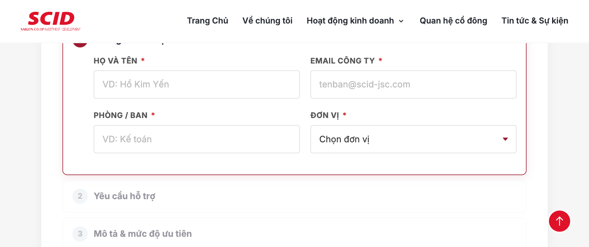
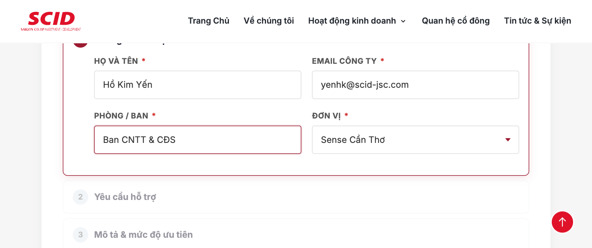
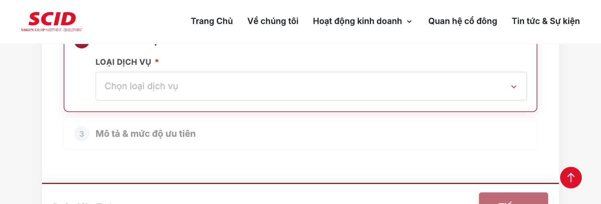
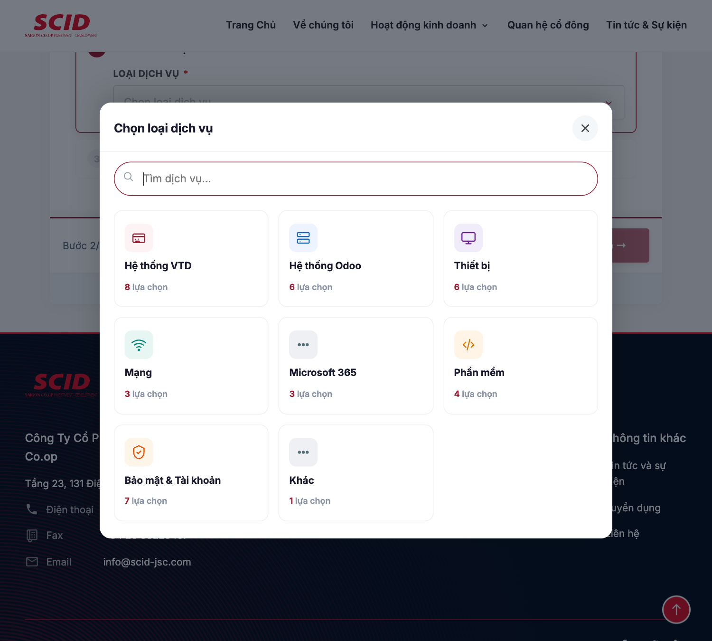
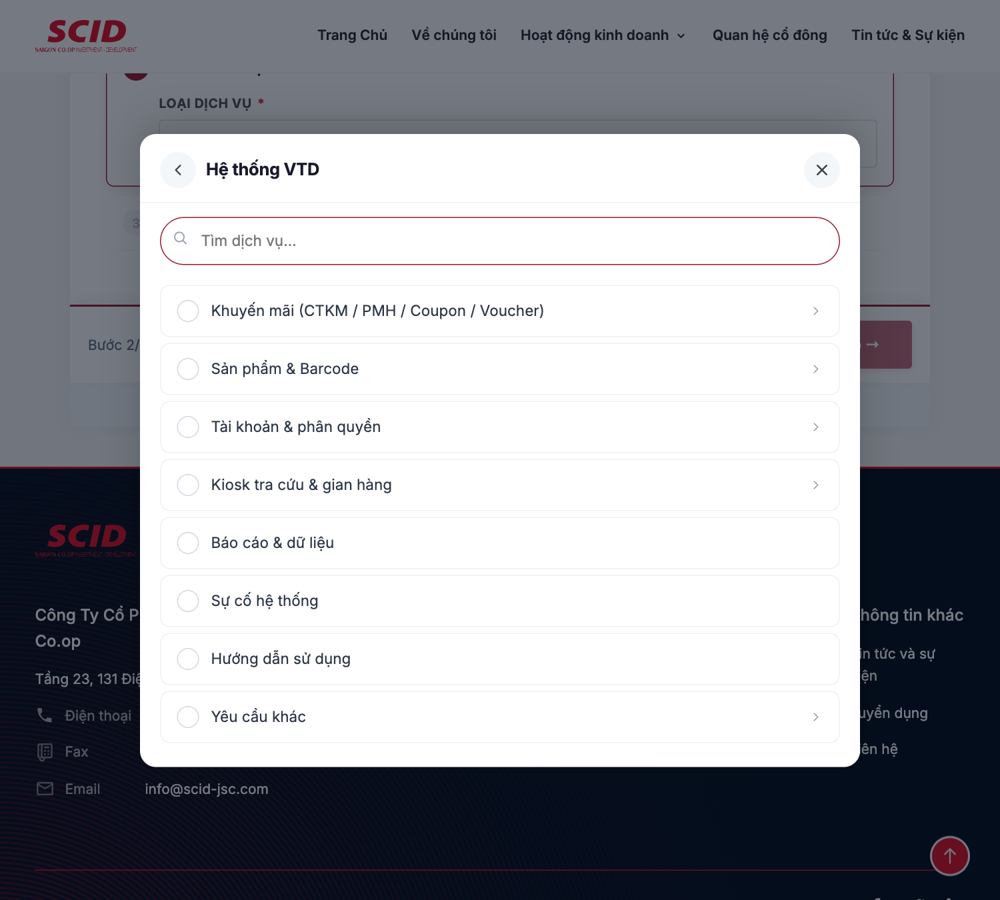
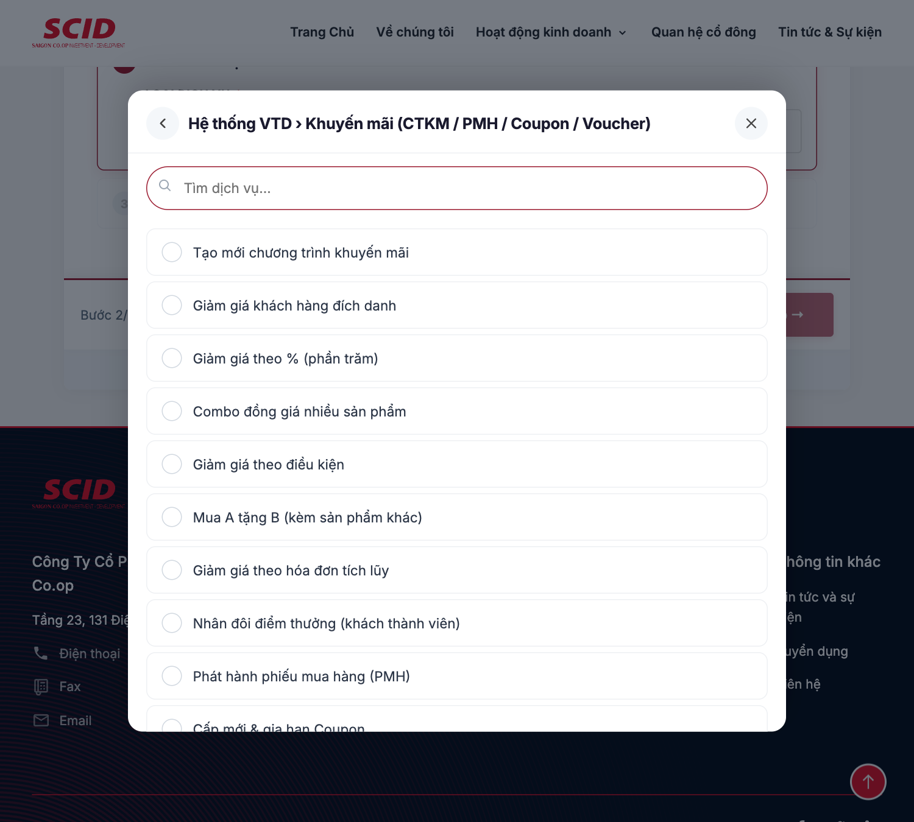
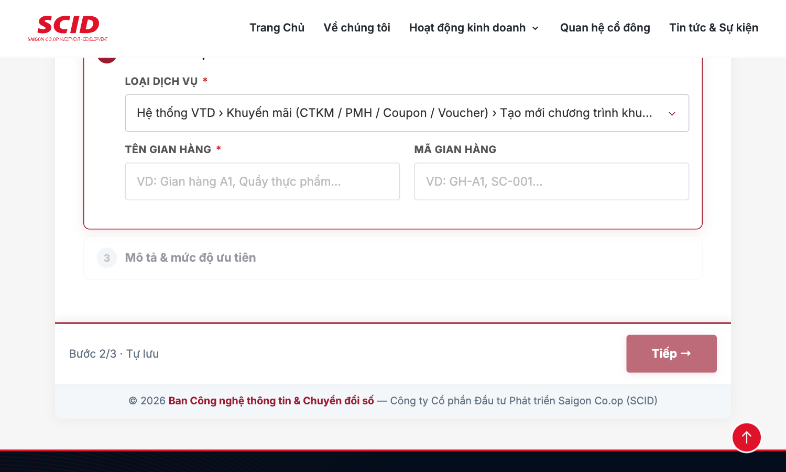
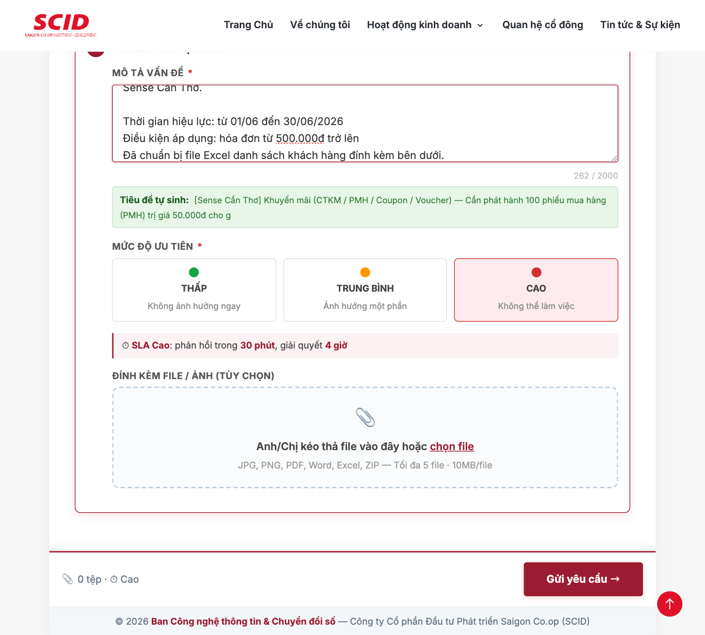
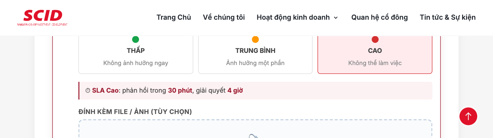
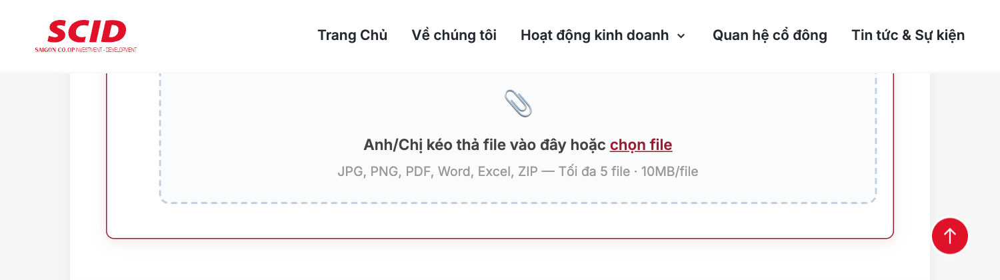

import {
  HaloPage,
  Hero,
  Callout,
  Tip,
  Note,
  FeatureGrid,
  CtaBanner,
  Feedback,
} from '@site/src/components/halo';
import docxUrl from '../dist/Huong-dan-su-dung-Helpdesk-SCID-v1.0.docx';

<HaloPage>

<Hero
  title="Hệ thống Helpdesk SCID"
  intro="Cổng tiếp nhận yêu cầu hỗ trợ Công nghệ thông tin cho cán bộ, nhân viên các đơn vị Sense. Gửi ticket, theo dõi tiến độ và phản hồi đều thực hiện qua một địa chỉ duy nhất."
  version="v1.0"
  updated="27/05/2026"
  readTime="≈ 6 phút đọc"
/>

<Callout label="Ban hành cho các đơn vị Sense">
  Tài liệu này hướng dẫn cán bộ, nhân viên các đơn vị Sense (Sense Cần Thơ, Sense Cà Mau, Sense Phạm Văn Đồng, Sense Bến Tre, Sense Cái Bè) sử dụng Hệ thống Helpdesk tại địa chỉ <strong>[scid.vn/helpdesk](https://scid.vn/helpdesk)</strong> để gửi yêu cầu hỗ trợ về Công nghệ thông tin.
</Callout>

## Tổng quan

Hệ thống Helpdesk tiếp nhận yêu cầu hỗ trợ thuộc 7 nhóm chính. Bấm vào thẻ để xem dịch vụ chi tiết bên dưới.

<FeatureGrid
  items={[
    {
      icon: '🛒',
      label: 'Hệ thống VTD',
      path: 'CTKM · PMH · Coupon',
      body: 'Khuyến mãi, voucher, sản phẩm, barcode, tài khoản ESSXanh/ESSCAM, kiosk tra cứu.',
    },
    {
      icon: '🧩',
      label: 'Hệ thống Odoo',
      path: 'HRMS · eOffice',
      body: 'HRMS, eOffice, báo cáo, các module nghiệp vụ trên nền Odoo.',
    },
    {
      icon: '💻',
      label: 'Thiết bị',
      path: 'Laptop · POS',
      body: 'Laptop, máy in, POS, các thiết bị ngoại vi tại điểm bán và văn phòng.',
    },
    {
      icon: '🛜',
      label: 'Mạng',
      path: 'Wi-Fi · VPN',
      body: 'Wi-Fi, đường truyền Internet, VPN truy cập nội bộ.',
    },
    {
      icon: '📧',
      label: 'Microsoft 365',
      path: 'Outlook · Teams',
      body: 'Email Outlook, Teams, OneDrive — cấp quyền và sự cố tài khoản.',
    },
    {
      icon: '🧰',
      label: 'Phần mềm',
      path: 'Windows · macOS',
      body: 'Cài đặt, bản quyền, sự cố hệ điều hành Windows / macOS.',
    },
    {
      icon: '🔐',
      label: 'Bảo mật & Tài khoản',
      path: 'MFA · phishing',
      body: 'Quên mật khẩu, MFA, phishing, virus, backup dữ liệu cá nhân.',
    },
    {
      icon: '📄',
      label: 'Tài liệu Word đầy đủ',
      path: 'docx · v1.0',
      body: 'Tải bản tài liệu chính thức có trang bìa, mục lục và phụ lục tra cứu nhanh.',
      link: { label: 'Tải xuống', href: docxUrl },
    },
  ]}
/>

## Truy cập

| Mục | Thông tin |
|-----|-----------|
| URL | [https://scid.vn/helpdesk](https://scid.vn/helpdesk) |
| Yêu cầu | Trình duyệt + email công ty (không cần đăng nhập) |
| Giờ làm việc | Thứ Hai – Thứ Sáu, 8h00 – 17h00 |
| Cam kết phản hồi | 30 phút (Cao) — 2 giờ (Trung bình) — 1 ngày (Thấp) |

## Form 3 bước

Form yêu cầu được chia thành 3 bước. Hoàn tất bước trước mới mở được bước sau.

### Bước 1 — Thông tin liên hệ

Điền 4 trường bắt buộc:

1. **Họ và tên** — VD: Hồ Kim Yến
2. **Email công ty** — VD: tenban@scid-jsc.com
3. **Phòng/Ban** — VD: Kế toán, Vận hành, Nhân sự
4. **Đơn vị** — Chọn từ danh sách (SCID hoặc 1 trong 5 đơn vị Sense)

Sau khi điền đầy đủ, Bước 1 sẽ tự kích hoạt Bước 2:

<Tip kind="warning">
  <strong>Email công ty bắt buộc.</strong> Phải dùng email công ty (`@scid-jsc.com` hoặc tên miền nội bộ). Email cá nhân (Gmail, Yahoo…) sẽ <strong>không nhận được thông báo</strong> từ hệ thống.
</Tip>

### Bước 2 — Yêu cầu hỗ trợ

Bấm vào nút **Chọn loại dịch vụ** để mở cửa sổ chọn:

Cửa sổ chọn hiển thị **8 nhóm chính**:

Chọn một nhóm (VD: **Hệ thống VTD**), danh sách dịch vụ con sẽ hiện. Mục có mũi tên `›` bên phải nghĩa là còn cấp con:

Tiếp tục chọn dịch vụ có cấp 3 (VD: **Khuyến mãi**) để xem 11 chức năng cụ thể:

#### Khi nào hiện Tên gian hàng + Mã gian hàng?

Hai trường này **chỉ hiển thị** khi:

- Loại dịch vụ là **Hệ thống VTD > Khuyến mãi** (CTKM/PMH/Coupon/Voucher); hoặc
- Loại dịch vụ là **Hệ thống VTD > Sản phẩm & Barcode**

Các trường hợp khác sẽ không hiện 2 ô này.

### Bước 3 — Mô tả, ưu tiên, đính kèm

**a) Mô tả vấn đề** — Tối thiểu 10 ký tự, tối đa 2.000 ký tự. Trả lời 4 câu:

1. Vấn đề xảy ra khi nào / ở đâu?
2. Thông báo lỗi cụ thể? (có ảnh chụp càng tốt)
3. Các bước đã thực hiện?
4. Ảnh hưởng đến công việc?

**b) Mức độ ưu tiên** — Chọn 1 trong 3:

| Mức | Ý nghĩa | Khi nào dùng |
|-----|---------|--------------|
| **Thấp** | Không ảnh hưởng ngay | Yêu cầu hướng dẫn, đề xuất, lỗi nhỏ |
| **Trung bình** | Ảnh hưởng một phần | Một thiết bị/chức năng không hoạt động, có cách workaround. **Mặc định.** |
| **Cao** | Không thể làm việc | Sự cố diện rộng: mất POS toàn quầy, mất Internet, rò rỉ bảo mật |

<Tip kind="danger">
  <strong>Chỉ chọn Cao khi thực sự cấp bách.</strong> Lạm dụng mức Cao sẽ làm chậm xử lý các yêu cầu khẩn cấp thật sự.
</Tip>

**c) Đính kèm file/ảnh** (tùy chọn):

- Loại file: JPG, PNG, GIF, PDF, DOC, DOCX, XLS, XLSX, TXT, ZIP
- Tối đa 5 file/yêu cầu, mỗi file ≤ 10 MB
- Tổng dung lượng ≤ 50 MB

## Cam kết phản hồi (SLA)

| Mức ưu tiên | Phản hồi đầu tiên | Cam kết xử lý |
|-------------|-------------------|---------------|
| **Cao** | Trong 30 phút (giờ hành chính) | Trong 4 giờ làm việc |
| **Trung bình** | Trong 2 giờ làm việc | Trong 1 ngày làm việc |
| **Thấp** | Trong 1 ngày làm việc | Trong 3 ngày làm việc |

<Note>
  Thời gian áp dụng trong giờ làm việc: 8h00 – 17h00, Thứ Hai – Thứ Sáu. Yêu cầu gửi ngoài giờ sẽ tính từ đầu giờ làm việc tiếp theo.
</Note>

## Sau khi gửi

1. Nhận email xác nhận với mã ticket (VD: `HD-2026-05-1234`)
2. Theo dõi cập nhật qua email công ty
3. Khi Ban CNTT giải quyết xong, nhận email kết thúc — trả lời `OK` để xác nhận hoặc `Chưa xong` kèm chi tiết để mở lại ticket
4. Sau 3 ngày không phản hồi, ticket tự đóng

## Trường hợp khẩn cấp

Đối với các sự cố nghiêm trọng — mất POS/VTD toàn quầy, mất Internet, nghi tấn công mạng, lộ dữ liệu — Anh/Chị:

1. Gửi yêu cầu qua [scid.vn/helpdesk](https://scid.vn/helpdesk) với mức ưu tiên **Cao** (vẫn bắt buộc để có ticket truy vết)
2. Đồng thời gọi điện trực tiếp đến đầu mối phụ trách CNTT đơn vị
3. Nếu sự cố bảo mật: **NGẮT mạng/tắt máy ngay** rồi báo (tránh lây lan)

<Tip kind="danger">
  <strong>Tấn công mạng / Virus — KHÔNG tự xử lý.</strong>
  <ul>
    <li><strong>KHÔNG</strong> tắt máy đột ngột nếu chưa được hướng dẫn</li>
    <li><strong>KHÔNG</strong> mở thêm file/link đáng ngờ</li>
    <li>Chụp ảnh màn hình lỗi và báo Ban CNTT ngay</li>
  </ul>
</Tip>

<CtaBanner
  eyebrow="Gửi yêu cầu trong 2 phút"
  title="Cần hỗ trợ CNTT? Mở Helpdesk ngay."
  sub="Mỗi yêu cầu được phân loại tự động và gửi đến đầu mối phù hợp trong vòng 30 phút giờ hành chính."
  primaryLabel="scid.vn/helpdesk →"
  primaryHref="https://scid.vn/helpdesk"
  secondaryLabel="Tải tài liệu Word"
  secondaryHref={docxUrl}
/>

<Feedback />

</HaloPage>
